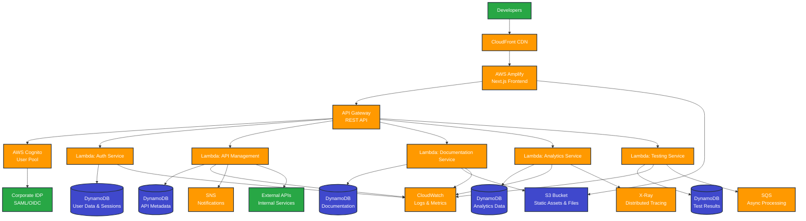
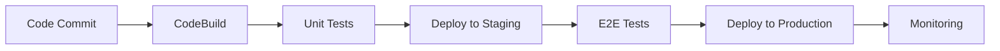

# AWS Serverless Architecture for Developer Portal

## Architecture Overview

The developer portal is built using a serverless-first approach on AWS, leveraging managed services to minimize operational overhead and costs.

## High-Level Architecture Diagram



## Detailed Component Architecture

### 1. Frontend Layer
```
┌─────────────────────────────────────┐
│           CloudFront CDN            │
│  • Global edge locations           │
│  • SSL termination                 │
│  • Compression & caching           │
│  • DDoS protection                 │
└─────────────────────────────────────┘
                    │
┌─────────────────────────────────────┐
│         AWS Amplify                 │
│  • Next.js application hosting     │
│  • Automatic deployments           │
│  • Custom domain support           │
│  • Environment management          │
└─────────────────────────────────────┘
```

### 2. API Layer
```
┌─────────────────────────────────────┐
│         API Gateway                 │
│  • REST API endpoints              │
│  • Request/response transformation │
│  • Rate limiting                   │
│  • API key management              │
│  • CORS configuration              │
└─────────────────────────────────────┘
                    │
┌─────────────────────────────────────┐
│         Lambda Functions            │
│  ┌─────────┐ ┌─────────┐ ┌─────────┐│
│  │  Auth   │ │   API   │ │   Doc   ││
│  │ Service │ │  Mgmt   │ │ Service ││
│  └─────────┘ └─────────┘ └─────────┘│
│  ┌─────────┐ ┌─────────┐            │
│  │Analytics│ │ Testing │            │
│  │ Service │ │ Service │            │
│  └─────────┘ └─────────┘            │
└─────────────────────────────────────┘
```

### 3. Data Layer
```
┌─────────────────────────────────────┐
│           DynamoDB Tables           │
│  ┌─────────┐ ┌─────────┐ ┌─────────┐│
│  │  Users  │ │   APIs  │ │   Docs  ││
│  │  Table  │ │  Table  │ │  Table  ││
│  └─────────┘ └─────────┘ └─────────┘│
│  ┌─────────┐ ┌─────────┐            │
│  │Analytics│ │  Tests  │            │
│  │  Table  │ │  Table  │            │
│  └─────────┘ └─────────┘            │
└─────────────────────────────────────┘
                    │
┌─────────────────────────────────────┐
│            S3 Buckets               │
│  • Static assets (images, CSS, JS) │
│  • API documentation files         │
│  • User uploaded files             │
│  • Backup and archival             │
└─────────────────────────────────────┘
```

## Service Details

### AWS Services Used

#### Compute & API
- **AWS Lambda**: Serverless compute for all backend logic
- **API Gateway**: REST API management and routing
- **AWS Amplify**: Frontend hosting and CI/CD

#### Database & Storage
- **Amazon DynamoDB**: Primary NoSQL database for all application data
- **Amazon S3**: Static file storage and asset hosting
- **Amazon CloudFront**: Global CDN for content delivery

#### Security & Authentication
- **AWS Cognito**: User authentication and authorization
- **AWS Secrets Manager**: Secure storage of API keys and secrets
- **AWS WAF**: Web application firewall protection

#### Monitoring & Observability
- **Amazon CloudWatch**: Logs, metrics, and alerting
- **AWS X-Ray**: Distributed tracing and performance monitoring
- **AWS CloudTrail**: API call auditing

#### Additional Services
- **Amazon SNS**: Push notifications and alerts
- **Amazon SQS**: Message queuing for async processing
- **Amazon SES**: Email notifications
- **AWS Systems Manager**: Parameter store for configuration

### Lambda Function Architecture

#### 1. Authentication Service
```typescript
// auth-service.ts
export const handler = async (event: APIGatewayProxyEvent) => {
  // JWT token validation
  // User session management
  // Role-based access control
  // API key validation
};
```

#### 2. API Management Service
```typescript
// api-management-service.ts
export const handler = async (event: APIGatewayProxyEvent) => {
  // API registration and discovery
  // API versioning
  // Rate limiting enforcement
  // Usage tracking
};
```

#### 3. Documentation Service
```typescript
// documentation-service.ts
export const handler = async (event: APIGatewayProxyEvent) => {
  // OpenAPI spec management
  // Interactive documentation generation
  // Code example management
  // Documentation versioning
};
```

#### 4. Analytics Service
```typescript
// analytics-service.ts
export const handler = async (event: APIGatewayProxyEvent) => {
  // Usage metrics collection
  // Performance monitoring
  // Developer activity tracking
  // Report generation
};
```

#### 5. Testing Service
```typescript
// testing-service.ts
export const handler = async (event: APIGatewayProxyEvent) => {
  // API endpoint testing
  // Mock data generation
  // Test result storage
  // Sandbox environment management
};
```

## Data Models

### DynamoDB Table Design

#### Users Table
```json
{
  "PK": "USER#user123",
  "SK": "PROFILE",
  "email": "developer@company.com",
  "name": "John Developer",
  "role": "developer",
  "permissions": ["read", "test"],
  "createdAt": "2024-01-01T00:00:00Z",
  "lastLogin": "2024-01-15T10:30:00Z"
}
```

#### APIs Table
```json
{
  "PK": "API#api123",
  "SK": "VERSION#v1",
  "name": "User Management API",
  "version": "1.0.0",
  "baseUrl": "https://api.company.com/v1",
  "openApiSpec": {...},
  "status": "active",
  "createdBy": "USER#user123",
  "createdAt": "2024-01-01T00:00:00Z"
}
```

#### Documentation Table
```json
{
  "PK": "DOC#api123",
  "SK": "VERSION#v1",
  "content": "API documentation content",
  "examples": [...],
  "lastUpdated": "2024-01-15T10:30:00Z",
  "updatedBy": "USER#user123"
}
```

## Security Architecture

### Network Security
- VPC with private subnets for Lambda functions
- Security groups with least privilege access
- WAF rules for common attack protection
- DDoS protection via CloudFront

### Data Security
- Encryption at rest (DynamoDB, S3)
- Encryption in transit (TLS 1.2+)
- Secrets management via AWS Secrets Manager
- Regular security audits and penetration testing

### Access Control
- Multi-factor authentication (MFA)
- Role-based access control (RBAC)
- API key rotation policies
- Session management with JWT tokens

## Cost Optimization

### Serverless Benefits
- **Pay-per-request**: Only pay for actual usage
- **Auto-scaling**: No idle server costs
- **Managed services**: Reduced operational overhead
- **Reserved capacity**: Available for predictable workloads

### Cost Monitoring
- AWS Cost Explorer for budget tracking
- CloudWatch billing alarms
- Automated cost optimization recommendations
- Resource tagging for cost allocation

## Deployment Strategy

### CI/CD Pipeline


### Environment Strategy
- **Development**: Feature branch deployments
- **Staging**: Pre-production testing
- **Production**: Stable releases with blue-green deployment

## Monitoring & Alerting

### Application Metrics
- API response times
- Error rates
- User activity
- System performance

### Business Metrics
- Developer adoption
- API usage patterns
- Feature utilization
- User satisfaction

### Alerting Rules
- High error rates (>5%)
- Slow response times (>2s)
- Unusual traffic patterns
- Security incidents
