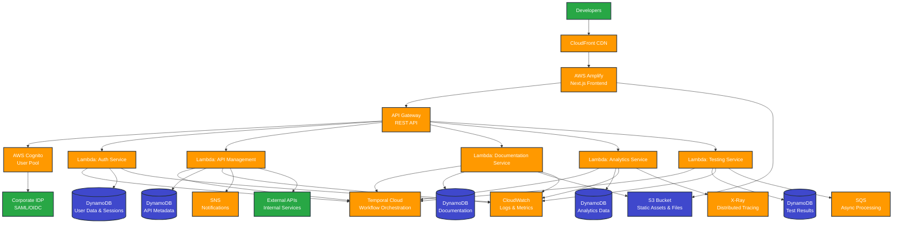
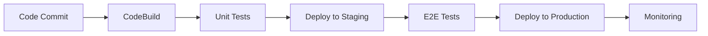

# AWS Serverless Architecture for Developer Portal

## Architecture Overview

The developer portal is built using a serverless-first approach on AWS, leveraging managed services to minimize operational overhead and costs. The architecture follows Infrastructure as Code (IaC) principles and Test-Driven Development (TDD) methodology.

## Test-Driven Development (TDD) Architecture

### Testing Pyramid
```
                    ┌─────────────────┐
                    │   E2E Tests     │ ← Cypress, Playwright
                    │   (Few, Slow)   │
                    └─────────────────┘
                 ┌─────────────────────┐
                 │ Integration Tests   │ ← API, Workflow Tests
                 │   (Some, Medium)    │
                 └─────────────────────┘
              ┌───────────────────────────┐
              │     Unit Tests           │ ← Jest, Testing Library
              │   (Many, Fast)           │
              └───────────────────────────┘
```

### Test Infrastructure
- **Unit Tests**: Jest + Testing Library for components and functions
- **Integration Tests**: API endpoint testing with real AWS services
- **E2E Tests**: Cypress and Playwright for user journey testing
- **Contract Tests**: OpenAPI specification validation
- **Infrastructure Tests**: CDK stack testing and validation

## Infrastructure as Code (IaC) Architecture

### CDK Stack Organization
```
infrastructure/
├── cdk/
│   ├── lib/
│   │   ├── auth-stack.ts          # Authentication infrastructure
│   │   ├── api-stack.ts           # API Gateway and Lambda
│   │   ├── database-stack.ts      # DynamoDB tables
│   │   ├── monitoring-stack.ts    # CloudWatch and X-Ray
│   │   └── security-stack.ts     # WAF, Secrets Manager
│   ├── bin/
│   │   └── dev-portal.ts          # CDK app entry point
│   └── test/
│       ├── auth-stack.test.ts     # Infrastructure tests
│       └── api-stack.test.ts      # Stack validation tests
```

### Infrastructure Testing
```typescript
// infrastructure/cdk/test/auth-stack.test.ts
import { Template } from 'aws-cdk-lib/assertions';
import { App } from 'aws-cdk-lib';
import { AuthStack } from '../lib/auth-stack';

describe('AuthStack', () => {
  test('should create Cognito User Pool', () => {
    const app = new App();
    const stack = new AuthStack(app, 'TestAuthStack');
    const template = Template.fromStack(stack);

    template.hasResourceProperties('AWS::Cognito::UserPool', {
      UserPoolName: 'dev-portal-users',
      Policies: {
        PasswordPolicy: {
          MinimumLength: 8,
          RequireLowercase: true,
          RequireUppercase: true,
          RequireDigits: true,
          RequireSymbols: true,
        },
      },
    });
  });

  test('should create API Gateway with CORS', () => {
    const app = new App();
    const stack = new AuthStack(app, 'TestAuthStack');
    const template = Template.fromStack(stack);

    template.hasResourceProperties('AWS::ApiGateway::RestApi', {
      Name: 'dev-portal-api',
    });
  });
});
```

### OpenAPI Specifications as Code
```yaml
# specs/auth/auth-api.yaml
openapi: 3.0.3
info:
  title: Authentication API
  description: User authentication and authorization endpoints
  version: 1.0.0
servers:
  - url: https://api.dev-portal.company.com/auth
    description: Production server
paths:
  /login:
    post:
      summary: User login
      description: Authenticate user with email and password
      requestBody:
        required: true
        content:
          application/json:
            schema:
              $ref: '#/components/schemas/LoginRequest'
      responses:
        '200':
          description: Successful login
          content:
            application/json:
              schema:
                $ref: '#/components/schemas/LoginResponse'
        '401':
          description: Invalid credentials
components:
  schemas:
    LoginRequest:
      type: object
      required:
        - email
        - password
      properties:
        email:
          type: string
          format: email
        password:
          type: string
          minLength: 8
    LoginResponse:
      type: object
      properties:
        accessToken:
          type: string
        refreshToken:
          type: string
        user:
          $ref: '#/components/schemas/User'
```

## High-Level Architecture Diagram



## Detailed Component Architecture

### 1. Frontend Layer
```
┌─────────────────────────────────────┐
│           CloudFront CDN            │
│  • Global edge locations           │
│  • SSL termination                 │
│  • Compression & caching           │
│  • DDoS protection                 │
└─────────────────────────────────────┘
                    │
┌─────────────────────────────────────┐
│         AWS Amplify                 │
│  • Next.js application hosting     │
│  • Automatic deployments           │
│  • Custom domain support           │
│  • Environment management          │
└─────────────────────────────────────┘
```

### 2. API Layer
```
┌─────────────────────────────────────┐
│         API Gateway                 │
│  • REST API endpoints              │
│  • Request/response transformation │
│  • Rate limiting                   │
│  • API key management              │
│  • CORS configuration              │
└─────────────────────────────────────┘
                    │
┌─────────────────────────────────────┐
│         Lambda Functions            │
│  ┌─────────┐ ┌─────────┐ ┌─────────┐│
│  │  Auth   │ │   API   │ │   Doc   ││
│  │ Service │ │  Mgmt   │ │ Service ││
│  └─────────┘ └─────────┘ └─────────┘│
│  ┌─────────┐ ┌─────────┐            │
│  │Analytics│ │ Testing │            │
│  │ Service │ │ Service │            │
│  └─────────┘ └─────────┘            │
└─────────────────────────────────────┘
```

### 3. Workflow Orchestration Layer
```
┌─────────────────────────────────────┐
│         Temporal Cloud               │
│  ┌─────────┐ ┌─────────┐ ┌─────────┐│
│  │  Auth   │ │   API   │ │   Doc   ││
│  │Workflow │ │Workflow │ │Workflow ││
│  └─────────┘ └─────────┘ └─────────┘│
│  ┌─────────┐ ┌─────────┐            │
│  │Analytics│ │ Testing │            │
│  │Workflow │ │Workflow │            │
│  └─────────┘ └─────────┘            │
└─────────────────────────────────────┘
                    │
┌─────────────────────────────────────┐
│         Workflow Activities          │
│  • User authentication flows        │
│  • API registration workflows       │
│  • Documentation generation         │
│  • Analytics data processing         │
│  • Test execution orchestration     │
└─────────────────────────────────────┘
```

### 4. Data Layer
```
┌─────────────────────────────────────┐
│           DynamoDB Tables           │
│  ┌─────────┐ ┌─────────┐ ┌─────────┐│
│  │  Users  │ │   APIs  │ │   Docs  ││
│  │  Table  │ │  Table  │ │  Table  ││
│  └─────────┘ └─────────┘ └─────────┘│
│  ┌─────────┐ ┌─────────┐            │
│  │Analytics│ │  Tests  │            │
│  │  Table  │ │  Table  │            │
│  └─────────┘ └─────────┘            │
└─────────────────────────────────────┘
                    │
┌─────────────────────────────────────┐
│            S3 Buckets               │
│  • Static assets (images, CSS, JS) │
│  • API documentation files         │
│  • User uploaded files             │
│  • Backup and archival             │
└─────────────────────────────────────┘
```

## Service Details

### AWS Services Used

#### Compute & API
- **AWS Lambda**: Serverless compute for all backend logic
- **API Gateway**: REST API management and routing
- **AWS Amplify**: Frontend hosting and CI/CD

#### Database & Storage
- **Amazon DynamoDB**: Primary NoSQL database for all application data
- **Amazon S3**: Static file storage and asset hosting
- **Amazon CloudFront**: Global CDN for content delivery

#### Security & Authentication
- **AWS Cognito**: User authentication and authorization
- **AWS Secrets Manager**: Secure storage of API keys and secrets
- **AWS WAF**: Web application firewall protection

#### Monitoring & Observability
- **Amazon CloudWatch**: Logs, metrics, and alerting
- **AWS X-Ray**: Distributed tracing and performance monitoring
- **AWS CloudTrail**: API call auditing

#### Workflow Orchestration
- **Temporal Cloud**: Workflow orchestration and state management
- **Temporal Workers**: Lambda functions as workflow activities
- **Temporal Web UI**: Workflow monitoring and debugging

#### Additional Services
- **Amazon SNS**: Push notifications and alerts
- **Amazon SQS**: Message queuing for async processing
- **Amazon SES**: Email notifications
- **AWS Systems Manager**: Parameter store for configuration

### Lambda Function Architecture

#### 1. Authentication Service
```typescript
// auth-service.ts
import { WorkflowClient } from '@temporalio/client';
import { authWorkflow } from './workflows/auth-workflow';

export const handler = async (event: APIGatewayProxyEvent) => {
  const client = new WorkflowClient();
  
  // Start authentication workflow
  const workflow = await client.start(authWorkflow, {
    args: [event],
    taskQueue: 'auth-service',
  });
  
  // Wait for workflow completion
  const result = await workflow.result();
  return result;
};
```

#### 2. API Management Service
```typescript
// api-management-service.ts
import { WorkflowClient } from '@temporalio/client';
import { apiManagementWorkflow } from './workflows/api-management-workflow';

export const handler = async (event: APIGatewayProxyEvent) => {
  const client = new WorkflowClient();
  
  // Start API management workflow
  const workflow = await client.start(apiManagementWorkflow, {
    args: [event],
    taskQueue: 'api-management',
  });
  
  const result = await workflow.result();
  return result;
};
```

#### 3. Documentation Service
```typescript
// documentation-service.ts
import { WorkflowClient } from '@temporalio/client';
import { documentationWorkflow } from './workflows/documentation-workflow';

export const handler = async (event: APIGatewayProxyEvent) => {
  const client = new WorkflowClient();
  
  // Start documentation workflow
  const workflow = await client.start(documentationWorkflow, {
    args: [event],
    taskQueue: 'documentation-service',
  });
  
  const result = await workflow.result();
  return result;
};
```

#### 4. Analytics Service
```typescript
// analytics-service.ts
import { WorkflowClient } from '@temporalio/client';
import { analyticsWorkflow } from './workflows/analytics-workflow';

export const handler = async (event: APIGatewayProxyEvent) => {
  const client = new WorkflowClient();
  
  // Start analytics workflow
  const workflow = await client.start(analyticsWorkflow, {
    args: [event],
    taskQueue: 'analytics-service',
  });
  
  const result = await workflow.result();
  return result;
};
```

#### 5. Testing Service
```typescript
// testing-service.ts
import { WorkflowClient } from '@temporalio/client';
import { testingWorkflow } from './workflows/testing-workflow';

export const handler = async (event: APIGatewayProxyEvent) => {
  const client = new WorkflowClient();
  
  // Start testing workflow
  const workflow = await client.start(testingWorkflow, {
    args: [event],
    taskQueue: 'testing-service',
  });
  
  const result = await workflow.result();
  return result;
};
```

## Temporal Workflow Patterns

### Workflow Architecture
Temporal provides robust workflow orchestration for complex business processes in the developer portal:

#### 1. Authentication Workflow
```typescript
// workflows/auth-workflow.ts
import { proxyActivities, log } from '@temporalio/workflow';
import type * as activities from '../activities/auth-activities';

const { validateToken, createSession, updateUserActivity } = proxyActivities<typeof activities>({
  startToCloseTimeout: '1 minute',
});

export async function authWorkflow(event: APIGatewayProxyEvent): Promise<AuthResult> {
  try {
    // Step 1: Validate JWT token
    const tokenValidation = await validateToken(event.headers.Authorization);
    
    if (!tokenValidation.isValid) {
      return { success: false, error: 'Invalid token' };
    }
    
    // Step 2: Create user session
    const session = await createSession(tokenValidation.userId);
    
    // Step 3: Update user activity
    await updateUserActivity(tokenValidation.userId, 'login');
    
    return { success: true, session, user: tokenValidation.user };
  } catch (error) {
    log.error('Authentication workflow failed', { error });
    throw error;
  }
}
```

#### 2. API Registration Workflow
```typescript
// workflows/api-management-workflow.ts
import { proxyActivities, log } from '@temporalio/workflow';
import type * as activities from '../activities/api-activities';

const { 
  validateApiSpec, 
  storeApiMetadata, 
  generateDocumentation, 
  notifyTeam 
} = proxyActivities<typeof activities>({
  startToCloseTimeout: '5 minutes',
});

export async function apiManagementWorkflow(event: APIGatewayProxyEvent): Promise<ApiResult> {
  try {
    const apiData = JSON.parse(event.body);
    
    // Step 1: Validate OpenAPI specification
    const validation = await validateApiSpec(apiData.openApiSpec);
    
    if (!validation.isValid) {
      return { success: false, errors: validation.errors };
    }
    
    // Step 2: Store API metadata in DynamoDB
    const apiRecord = await storeApiMetadata(apiData);
    
    // Step 3: Generate documentation
    const documentation = await generateDocumentation(apiData.openApiSpec);
    
    // Step 4: Notify team members
    await notifyTeam(apiRecord.createdBy, 'API_REGISTERED', apiRecord);
    
    return { success: true, api: apiRecord, documentation };
  } catch (error) {
    log.error('API management workflow failed', { error });
    throw error;
  }
}
```

#### 3. Analytics Processing Workflow
```typescript
// workflows/analytics-workflow.ts
import { proxyActivities, log } from '@temporalio/workflow';
import type * as activities from '../activities/analytics-activities';

const { 
  collectMetrics, 
  processAnalytics, 
  generateReport, 
  storeResults 
} = proxyActivities<typeof activities>({
  startToCloseTimeout: '10 minutes',
});

export async function analyticsWorkflow(event: APIGatewayProxyEvent): Promise<AnalyticsResult> {
  try {
    const { apiId, dateRange } = JSON.parse(event.body);
    
    // Step 1: Collect metrics from multiple sources
    const metrics = await collectMetrics(apiId, dateRange);
    
    // Step 2: Process analytics data
    const processedData = await processAnalytics(metrics);
    
    // Step 3: Generate comprehensive report
    const report = await generateReport(processedData);
    
    // Step 4: Store results for future queries
    await storeResults(apiId, report);
    
    return { success: true, report, metrics: processedData };
  } catch (error) {
    log.error('Analytics workflow failed', { error });
    throw error;
  }
}
```

### Workflow Benefits
- **Reliability**: Automatic retries and error handling
- **Observability**: Built-in workflow monitoring and debugging
- **Scalability**: Handle complex, long-running processes
- **State Management**: Persistent workflow state across Lambda invocations
- **Compensation**: Automatic rollback capabilities for failed operations

## Data Models

### DynamoDB Table Design

#### Users Table
```json
{
  "PK": "USER#user123",
  "SK": "PROFILE",
  "email": "developer@company.com",
  "name": "John Developer",
  "role": "developer",
  "permissions": ["read", "test"],
  "createdAt": "2024-01-01T00:00:00Z",
  "lastLogin": "2024-01-15T10:30:00Z"
}
```

#### APIs Table
```json
{
  "PK": "API#api123",
  "SK": "VERSION#v1",
  "name": "User Management API",
  "version": "1.0.0",
  "baseUrl": "https://api.company.com/v1",
  "openApiSpec": {...},
  "status": "active",
  "createdBy": "USER#user123",
  "createdAt": "2024-01-01T00:00:00Z"
}
```

#### Documentation Table
```json
{
  "PK": "DOC#api123",
  "SK": "VERSION#v1",
  "content": "API documentation content",
  "examples": [...],
  "lastUpdated": "2024-01-15T10:30:00Z",
  "updatedBy": "USER#user123"
}
```

## Security Architecture

### Network Security
- VPC with private subnets for Lambda functions
- Security groups with least privilege access
- WAF rules for common attack protection
- DDoS protection via CloudFront

### Data Security
- Encryption at rest (DynamoDB, S3)
- Encryption in transit (TLS 1.2+)
- Secrets management via AWS Secrets Manager
- Regular security audits and penetration testing

### Access Control
- Multi-factor authentication (MFA)
- Role-based access control (RBAC)
- API key rotation policies
- Session management with JWT tokens

## Cost Optimization

### Serverless Benefits
- **Pay-per-request**: Only pay for actual usage
- **Auto-scaling**: No idle server costs
- **Managed services**: Reduced operational overhead
- **Reserved capacity**: Available for predictable workloads

### Cost Monitoring
- AWS Cost Explorer for budget tracking
- CloudWatch billing alarms
- Automated cost optimization recommendations
- Resource tagging for cost allocation

## Deployment Strategy

### CI/CD Pipeline


### Environment Strategy
- **Development**: Feature branch deployments
- **Staging**: Pre-production testing
- **Production**: Stable releases with blue-green deployment

## Monitoring & Alerting

### Application Metrics
- API response times
- Error rates
- User activity
- System performance

### Business Metrics
- Developer adoption
- API usage patterns
- Feature utilization
- User satisfaction

### Alerting Rules
- High error rates (>5%)
- Slow response times (>2s)
- Unusual traffic patterns
- Security incidents
